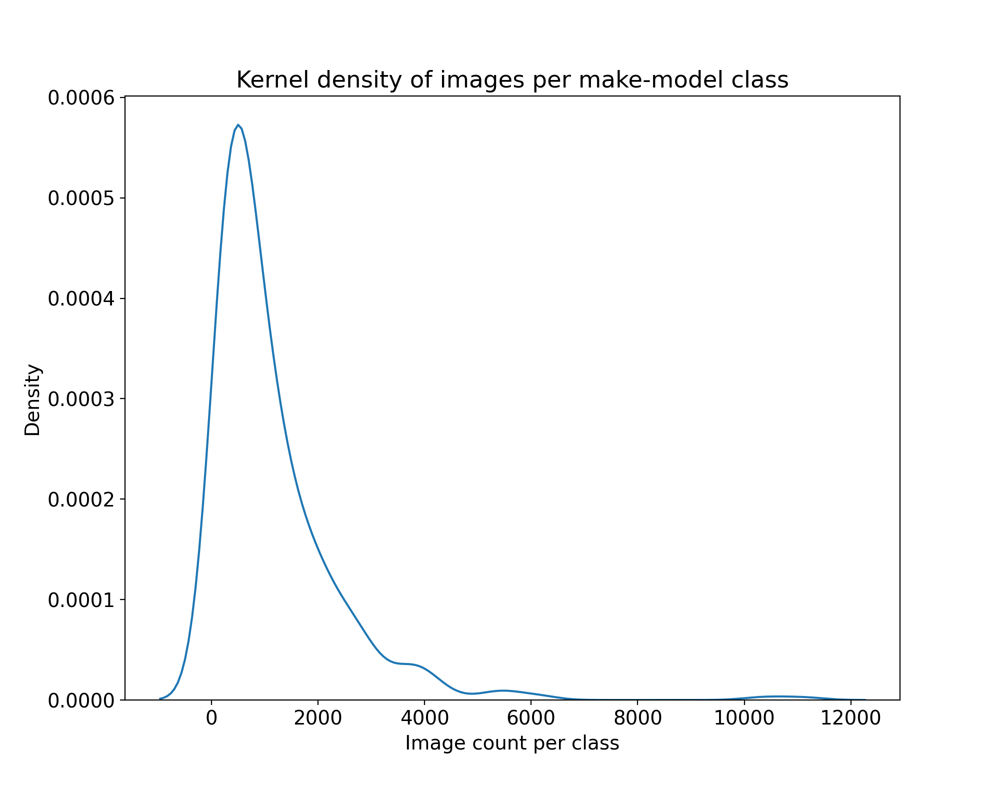

# Table of contents
- [Introduction](#introduction)
  - [Defining classes](#defining-classes)
- [About the data](#about-the-data)
    - [Manufacturers, years present and number of models](#manufacturers-years-present-and-number-of-models)
    - [Images per class](#images-per-class)
    - [Most and least populous classes](#most--least-populous-classes)
    - [Images per class](#images-per-class)
- [Dataset construction](#dataset-construction)
  - [Sampling frame](#sampling-frame)
  - [Analytic restrictions](#analytic-restrictions)
  - [Sampling method](#sampling-method)
- [Pipeline to create image dataset](#pipeline-to-create-image-dataset)

# Introduction
This repository develops a large (n=664,678) image dataset of 40 passenger vehicle manufacturers and 574 distinct make-model classes. These data are widely representative of domestic and foreign passenger vehicles commonly found in the U.S., encompassing vehicle make-models manufactured between 2000 and 2021/2.

These data were created for a [computer vision classification task](https://github.com/kingjosephm/vehicle_make_model_classifier) but their use extends potentially beyond this project. These images were gathered by scraping Google, using a representative list of vehicles sold in the U.S. from the [back4app.com](https://github.com/kingjosephm/vehicle_make_model_classifier) database, an open-source dataset providing detailed information about motor vehicles sold in the U.S. in recent decades.

The code used to scrape these images can be found  in the [code](./code) directory. Further explanation about how this code was used and how our images were gathered can be found [below](#dataset-construction).

The data can be downloaded [here](https://boozallen.sharepoint.com/:u:/r/sites/MERGEN/Shared%20Documents/Data/scraped_images.zip?csf=1&web=1&e=xdaZqz).

## Defining classes
For the purposes of the study that motivated the construction of these data, we define classes based on the concatenation of make and model, pooling across all years. "Model" here is defined by combining detailed submodels, e.g. "Ford F-150 regular cab", "Ford F-150 crew cab", into one aggregated model, e.g. "Ford F-Series". This produces 574 distinct make-model classes.

However, the scraping scripts produce a dataset that is organized in make, model, year subdirectories. Defining classes instead based on the concatenation of make, model, and year would yield 5,287 distinct classes, another possibility with these data.

A perhaps more ideal definition of classes would be based on vehicle make-model-**generation**, which would span multiple years. We unfortunately lacked the time for this, but would be a worthwhile future approach.

# About the data

## Manufacturers, years present, and number of models

| Manufacturer | Years in Database | Number of Models |
| --------- | ----- | ------- |
| Acura | 2000-2022 | 13 
| Audi | 2000-2021 | 26
| BMW | 2000-2021 | 27
| Buick | 2000-2021 | 14
| Cadillac | 2000-2021 | 19
| Chevrolet | 2000-2022 | 38
| Chrysler | 2000-2021 | 14
| Dodge | 2000-2021 | 18
| Fiat | 2012-2021 | 2
| Ford | 2000-2021 | 28
| GMC | 2000-2022 | 11
| HUMMER | 2000-2010 | 4
| Honda | 2000-2022 | 17
| Hyundai | 2000-2022 | 18
| INFINITI | 2000-2021 | 17
| Jaguar | 2000-2021 | 10
| Jeep | 2000-2022 | 9
| Kia | 2000-2022 | 19
| Land Rover | 2000-2021 | 6
| Lexus | 2000-2021 | 15
| Lincoln | 2000-2021 | 15
| MINI | 2002-2020 | 8
| Mazda | 2000-2021  | 18
| Mercedes-Benz | 2000-2022 | 28
| Mercury | 2000-2011 | 11
| Mitsubishi | 2000-2022 | 11 
| Nissan | 2000-2022  | 20
| Pontiac | 2000-2010 | 15
| Porsche | 2000-2021 | 11
| RAM | 2011-2021 | 4
| Saab | 2000-2011 | 5
| Saturn | 2000-2010 | 9
| Scion | 2004-2016 | 8
| Subaru | 2000-2022  | 12
| Suzuki | 2000-2013 |  12
| Tesla | 2012-2021 | 3
| Toyota | 2000-2021  | 24 
| Volkswagen | 2000-2022 | 18 
| Volvo | 2000-2021 | 16
| smart | 2008-2018 | 1

## Images per class

| Moment | Value |
| ------ | ----- |
| Count | 574 |
| Mean | 1157.98 |
| Std | 1247.13 |
| Min | 90 |
| 25% | 370.75 |
| 50% | 748 |
| 75% | 1478.75 |
| Max | 11210 |

   

## Most & least populous classes

## Images per class

# Dataset construction

### Sampling frame
- To create a representative sample of vehicle make and model images for the U.S. passenger vehicle market we rely on the [back4app.com](https://www.back4app.com/database/back4app/car-make-model-dataset) database, an open-source dataset providing detailed information about motor vehicles sold in the US between the years 1992 and 2022. 

- A copy of this database is stored locally in `./data/make_model_database.csv`. At the time the data were queried, this database contained information on vehicles up through and including 2022 models, though 2022 models are only available for some manufacturers.

- See [back4app_database_analysis](./analyses/back4app_database_analysis.ipynb) for a more detailed analysis of this database

### Analytic restrictions
- The [back4app.com](https://www.back4app.com/database/back4app/car-make-model-dataset) database contained 59 manufacturers. We drop 4 small vehicle manufacturers (e.g. Fisker, Polestar, Panoz, Rivian), 8 exotic car manufacturers (e.g. Ferrari, Lamborghini, Maserati, Rolls-Royce, McLaren, Bentley, Aston Martin, Lotus), and 7 brands with sparse information in the dataset (e.g. Alfa Romeo, Daewoo, Isuzu, Genesis, Mayback, Plymouth, Oldsmobile), reducing the number of distinct vehicle manufacturers in the data to 40.

- Rows in this database table are uniquely identified by make, (detailed) model, category (e.g. cabriolet, sedan), and year. For example, a 2006 BMW Z4 M Convertible or a 2017 Audi A5 Sport Coupe. In total there are 8,274 unique combinations.

### Sampling method
- For each of the 8,274 unique make-(detailed-)model-category-year combinations we scrape Google, attempting to download 100 images each. Since not all of the scraped links are usually valid, this often results in 85-90 savable JPG images per combination.

- As we iterate through each unique make-(detailed-)model-category-year combination, we keep a running list of the valid URLs from which we downloaded images. If a URL was previously seen (i.e. we already have that image) we move onto the next URL. This helps to reduce duplicate images in our data. However, we are unable to identify if the same photo if it is posted across multiple URLs.

- Resulting images from this iterative process are saved in nested make, model, year directories as specified by the user's command line root directory path. We combine detailed models from the same year, including all categories of vehicles therein, into the **same** directory. This shrinks the number of unique combinations to 5,287.

- Although we didn't conduct a formal empirical analysis to verify the returned scraped images matched their label, we sifted through hundreds of images over the course of the study and found few mismatches.

# Pipeline to create image dataset
The following scripts were run in this order to create the sample of training images:

  1) [get_make_model_db.py](./code/get_make_model_db.py): queries the back4app database, outputting `./data/make_model_database.csv`
   
  2) [restrict_population_make_models.py](./code/restrict_population_make_models.py): standardizes and fixes some errors in vehicle makes and models, outputting `./data/make_model_database_mod.csv`
   
  3) [scrape_vehicle_make_models.py](./code/scrape_vehicle_make_models.py): scrapes Google Images